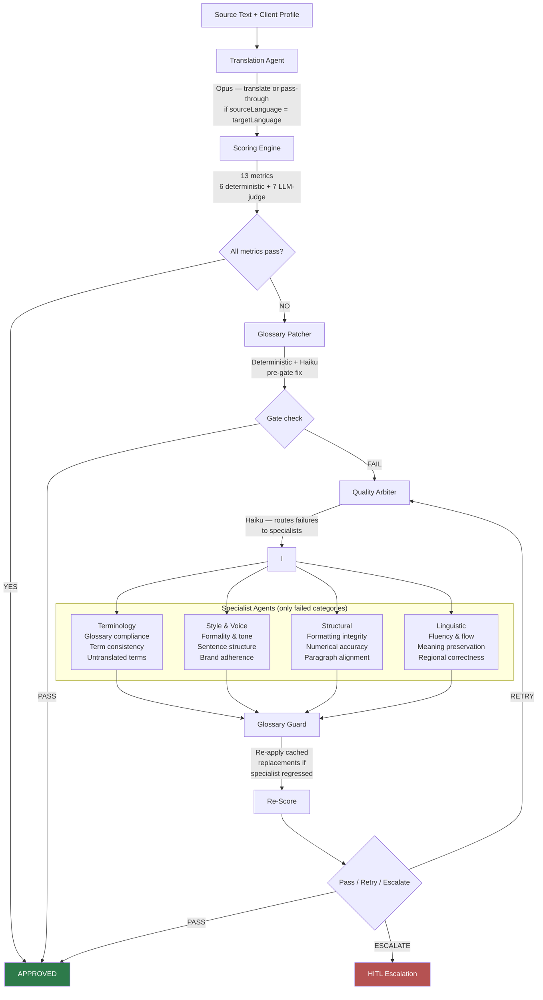
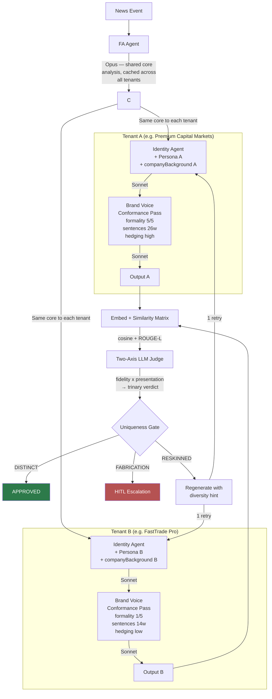
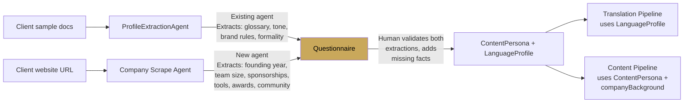

# Pipeline Reference

Single source of truth for both FinFlow processing workflows. Updated as steps are added or modified.

**Last updated:** 2026-04-10

---

## 1. Translation Quality Pipeline

Takes existing content and enforces client-specific quality standards. Optionally translates.

**Status:** Fully implemented in `packages/api/src/pipeline/translation-engine.ts`.

**Key files:**
- `pipeline/translation-engine.ts` — orchestration
- `scoring/deterministic.ts` + `scoring/llm-judge.ts` — 13 metrics
- `pipeline/glossary-patcher.ts` — deterministic + Haiku glossary enforcement
- `agents/specialists/*.ts` — 4 specialist agents
- `agents/quality-arbiter.ts` — specialist dispatch
- `profiles/types.ts` — `LanguageProfile`, `ToneProfile`, `ScoringConfig`

---

## 2. Content Generation Pipeline

Takes a news event and produces differentiated broker reports. The conformance pass reuses the translation engine's Style & Voice capability.

**Status:** PoC implemented in `packages/api/src/benchmark/uniqueness-poc/`. Conformance pass validated 2026-04-10 (presentation 0.52 → 0.32).

**Key files:**
- `benchmark/uniqueness-poc/runner.ts` — orchestration (Stages 1-7)
- `benchmark/uniqueness-poc/conformance-pass.ts` — brand voice enforcement
- `benchmark/uniqueness-poc/llm-judge.ts` — two-axis uniqueness judge
- `benchmark/uniqueness-poc/similarity.ts` — embeddings + ROUGE-L
- `benchmark/uniqueness-poc/types.ts` — `ContentPersona`, `companyBackground`
- `benchmark/uniqueness-poc/personas/*.json` — broker persona fixtures

---

## 3. What crosses between the two pipelines

| Component | Translation pipeline | Content pipeline | Shared? |
|---|---|---|---|
| **Style & Voice enforcement** | `correctStyle()` specialist — fixes formality, sentence structure, brand adherence against a `LanguageProfile`. **TODO: remove from translation pipeline** — when content flows through the content pipeline's conformance pass first, brand voice is already enforced before translation. Running it again in the translation loop is redundant and risks undoing the divergence the conformance pass created. The translation pipeline should only enforce language-level quality (Terminology, Structural, Linguistic), not brand voice. | Dedicated brand-voice prompt via `callAgentWithUsage` — rewrites for persona formality, hedging, company background. This is the canonical location for brand voice enforcement. | **Content pipeline owns Style & Voice**. Translation pipeline to be stripped of it. |
| **Terminology / Glossary** | `glossary-patcher.ts` — deterministic + Haiku, per-language | Not yet wired (planned §20.5 Part B). English glossary could add deterministic divergence. | **Planned** |
| **Structural specialist** | Fixes formatting vs source document | N/A — no source document in content generation | **No** |
| **Linguistic specialist** | Fixes fluency, meaning, regional correctness | N/A — content is generated, not translated | **No** |
| **13-metric scoring** | Full loop with gate + retry | N/A — uniqueness uses a different metric (cosine + judge) | **No** |
| **`callAgentWithUsage`** | Used by all specialists | Used by conformance pass | **Yes — shared infrastructure** |
| **`parseSpecialistResponse`** | Parses `---REASONING---` separator | Same parser, same format | **Yes — shared code** |
| **`LanguageProfile` / `ToneProfile`** | Input to specialists and scoring | `inferToneFromPersona()` maps `ContentPersona` → tone fields | **Type shared**, adapter bridges them |
| **`ProfileExtractionAgent`** | Extracts writing style from sample docs | Part of unified onboarding (+ company scrape + questionnaire) | **Yes — shared agent** |

---

## 4. Divergence layers in the content pipeline

Layers stack — each is independent and additive.

| Layer | What it does | Status | Expected impact |
|---|---|---|---|
| **Identity agent** | Different writer persona (Beginner Blogger vs Trading Desk) | Implemented | High for cross-identity, none for same-identity cross-tenant |
| **Persona overlay** | Brand voice, audience, CTAs, tags injected into identity prompt | Implemented | Low (~0.05 presentation drop). Same blueprint, different words. |
| **companyBackground** | Factual company claims injected at generation + conformance time | Implemented | Medium — unique material by construction |
| **Brand voice conformance pass** | Style & Voice rewrite per persona (formality, hedging, sentences) | Implemented | **High — 0.20 presentation drop validated** |
| **Section labels + termMap** (§20.5 Part A) | Per-persona section header labels and domain terminology | Planned | Medium — visual differentiation |
| **Terminology / glossary patcher** (§20.5 Part B) | Deterministic term substitution per tenant | Planned | Medium — deterministic, guaranteed divergence |
| **Structural template** | Per-persona section order and count (e.g. Premium: context→analysis→scenarios vs FastTrade: trade→levels→risk) | Planned (discussed 2026-04-10, not yet specced) | High — breaks identical narrative blueprints |
| **Per-tenant FA angle** (Option 3) | Separate FA pass per persona (different analytical framing) | Discussed, parked | Highest — different source material |

---

## 5. Onboarding flow (unified)

Feeds both pipelines. Three steps, one human review.

**Status:** ProfileExtractionAgent exists. Company scrape agent and questionnaire are planned.

---

## 6. Planned changes

| Task | Scope | What changes | Why |
|---|---|---|---|
| **Remove Style & Voice from translation pipeline** | Translation engine | Remove `correctStyle()` from specialist dispatch. Drop 3 metrics (`formality_level`, `sentence_length_ratio`, `brand_voice_adherence`) from scoring — 13 metrics → 10. Rewire `METRIC_CATEGORIES.style` removal through gate, arbiter, aggregate scoring, thresholds, and any code that references style metrics. Update `ProfileExtractionAgent` to stop extracting tone fields into `LanguageProfile` (they move to `ContentPersona` only). | Content pipeline's conformance pass is the canonical owner of brand voice. Running Style & Voice again in translation is redundant and risks undoing conformance-pass divergence. |
| **Add `preferredStructure` to ContentPersona** | Content pipeline | New field on `ContentPersona`: per-persona section order and count directive, injected into identity agent's user message. E.g. Premium: "context → analysis → scenarios → levels" vs FastTrade: "trade idea → levels → why → risk". | Conformance pass fixed voice divergence but document structure (section order, narrative arc) is still identical between personas. `preferredStructure` breaks the blueprint. |
| **Wire glossary patcher into content pipeline** (§20.5 Part B) | Content pipeline | Pipe each cross-tenant output through `glossary-patcher.ts` with a per-tenant English glossary after the conformance pass. Deterministic term substitution. | Adds a third divergence layer (terminology) on top of voice (conformance pass) and structure (`preferredStructure`). |
| **Company scrape agent** | Onboarding | New agent that scrapes client website (about/team/press pages) and extracts candidate `companyBackground` facts. Feeds into the unified onboarding questionnaire. | `companyBackground` is currently manually authored in persona JSON fixtures. Production needs automated extraction. |
| **Section labels + termMap** (§20.5 Part A) | Content pipeline | Per-persona section label and domain terminology overrides on `ContentPersona`. Identity agents substitute placeholders against the persona's map. | "WHAT:" vs "THE SETUP:" vs "POSITIONING:" — visual differentiation at the label level. |
