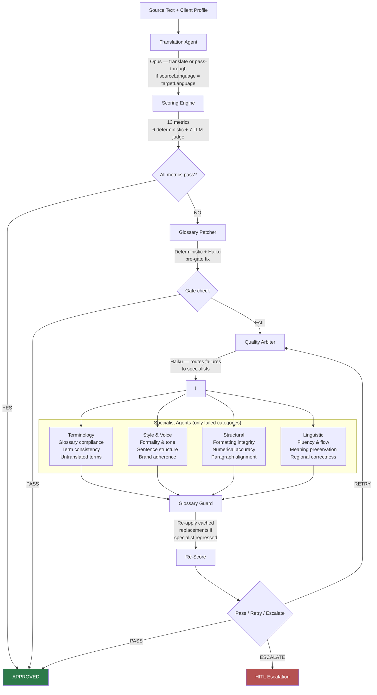
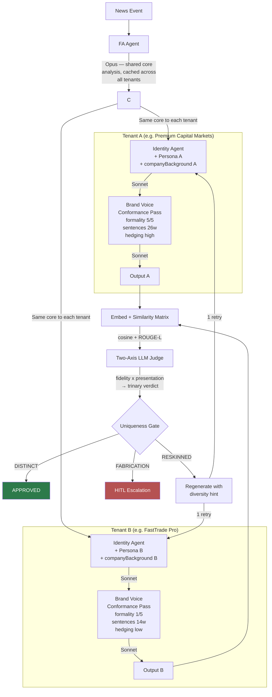
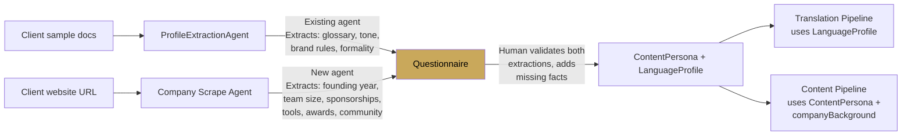

# Pipeline Reference

Single source of truth for both FinFlow processing workflows. Updated as steps are added or modified.

**Last updated:** 2026-04-10

---

## 1. Translation Quality Pipeline

Takes existing content and enforces client-specific quality standards. Optionally translates.

**Status:** Fully implemented in `packages/api/src/pipeline/translation-engine.ts`.

**Key files:**
- `pipeline/translation-engine.ts` — orchestration
- `scoring/deterministic.ts` + `scoring/llm-judge.ts` — 13 metrics
- `pipeline/glossary-patcher.ts` — deterministic + Haiku glossary enforcement
- `agents/specialists/*.ts` — 4 specialist agents
- `agents/quality-arbiter.ts` — specialist dispatch
- `profiles/types.ts` — `LanguageProfile`, `ToneProfile`, `ScoringConfig`

---

## 2. Content Generation Pipeline

Takes a news event and produces differentiated broker reports. The conformance pass reuses the translation engine's Style & Voice capability.

**Status:** PoC implemented in `packages/api/src/benchmark/uniqueness-poc/`. Conformance pass validated 2026-04-10 (presentation 0.52 → 0.32).

**Key files:**
- `benchmark/uniqueness-poc/runner.ts` — orchestration (Stages 1-7)
- `benchmark/uniqueness-poc/conformance-pass.ts` — brand voice enforcement
- `benchmark/uniqueness-poc/llm-judge.ts` — two-axis uniqueness judge
- `benchmark/uniqueness-poc/similarity.ts` — embeddings + ROUGE-L
- `benchmark/uniqueness-poc/types.ts` — `ContentPersona`, `companyBackground`
- `benchmark/uniqueness-poc/personas/*.json` — broker persona fixtures

---

## 3. What crosses between the two pipelines

| Component | Translation pipeline | Content pipeline | Shared? |
|---|---|---|---|
| **Style & Voice enforcement** | `correctStyle()` specialist — fixes formality, sentence structure, brand adherence against a `LanguageProfile` | Dedicated brand-voice prompt via `callAgentWithUsage` — rewrites for persona formality, hedging, company background | **Pattern shared**, not code. Content pipeline uses a dedicated prompt, not the translation specialist directly. |
| **Terminology / Glossary** | `glossary-patcher.ts` — deterministic + Haiku, per-language | Not yet wired (planned §20.5 Part B). English glossary could add deterministic divergence. | **Planned** |
| **Structural specialist** | Fixes formatting vs source document | N/A — no source document in content generation | **No** |
| **Linguistic specialist** | Fixes fluency, meaning, regional correctness | N/A — content is generated, not translated | **No** |
| **13-metric scoring** | Full loop with gate + retry | N/A — uniqueness uses a different metric (cosine + judge) | **No** |
| **`callAgentWithUsage`** | Used by all specialists | Used by conformance pass | **Yes — shared infrastructure** |
| **`parseSpecialistResponse`** | Parses `---REASONING---` separator | Same parser, same format | **Yes — shared code** |
| **`LanguageProfile` / `ToneProfile`** | Input to specialists and scoring | `inferToneFromPersona()` maps `ContentPersona` → tone fields | **Type shared**, adapter bridges them |
| **`ProfileExtractionAgent`** | Extracts writing style from sample docs | Part of unified onboarding (+ company scrape + questionnaire) | **Yes — shared agent** |

---

## 4. Divergence layers in the content pipeline

Layers stack — each is independent and additive.

| Layer | What it does | Status | Expected impact |
|---|---|---|---|
| **Identity agent** | Different writer persona (Beginner Blogger vs Trading Desk) | Implemented | High for cross-identity, none for same-identity cross-tenant |
| **Persona overlay** | Brand voice, audience, CTAs, tags injected into identity prompt | Implemented | Low (~0.05 presentation drop). Same blueprint, different words. |
| **companyBackground** | Factual company claims injected at generation + conformance time | Implemented | Medium — unique material by construction |
| **Brand voice conformance pass** | Style & Voice rewrite per persona (formality, hedging, sentences) | Implemented | **High — 0.20 presentation drop validated** |
| **Section labels + termMap** (§20.5 Part A) | Per-persona section header labels and domain terminology | Planned | Medium — visual differentiation |
| **Terminology / glossary patcher** (§20.5 Part B) | Deterministic term substitution per tenant | Planned | Medium — deterministic, guaranteed divergence |
| **Structural template** | Per-persona section order and count (e.g. Premium: context→analysis→scenarios vs FastTrade: trade→levels→risk) | Planned (discussed 2026-04-10, not yet specced) | High — breaks identical narrative blueprints |
| **Per-tenant FA angle** (Option 3) | Separate FA pass per persona (different analytical framing) | Discussed, parked | Highest — different source material |

---

## 5. Onboarding flow (unified)

Feeds both pipelines. Three steps, one human review.

**Status:** ProfileExtractionAgent exists. Company scrape agent and questionnaire are planned.
